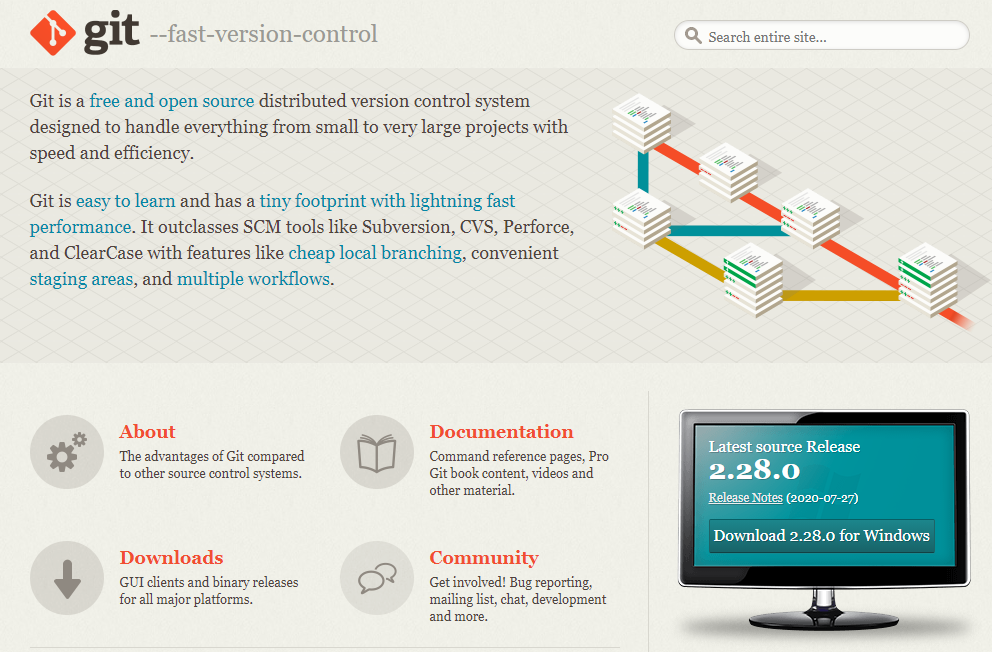
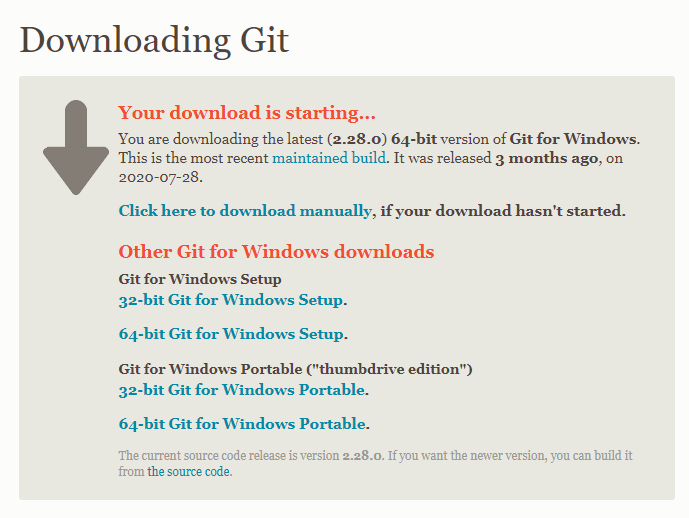
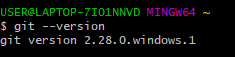
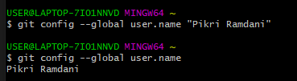
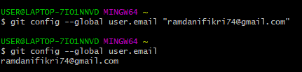
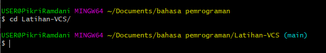
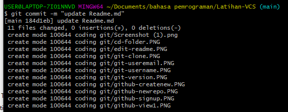

# Latihan-VCS
Repository ini dibuat untuk memenuhi tugas Pertemuan 4-Bahasa Pemrograman

Nama    : Pikri Ramdani

NIM     : 312010162

KELAS   : TI.20.A.1

## Langkah-Langkah Penggunaan Git

* Langkah pertama Download Git,buka website resminya git [click here](https://git-scm.com)

 

* kemudian unduh git sesuai dengan arsitektur komputer kita. kalau menggunakan 64bit, unduh yang 64bit. begitu juga kalo menggunakan 32bit.

* selamat, Git sudah terinstal di windows. untuk mencobanya, silahkan buka CMD atau PowerShell, kemudian ketik perintah git-version.

 ## Menambahkan Global Config

 * pada saat pertama kali menggunakan git, perlu dilakukan konfigurasi user.name dan user.email

 * konfigurasi ini bisa dilakukan untuk global repository atau individual repository

 * apabila belum dilakukan konfigurasi, akan mengakibatkan terjadi kegagalan saat menjalankan perintah git commit

 * config global repository $ git config --global user.name "masukan nama anda"

 * $ git config --global user.email "masukan email anda"

 

 ## Perintah Dasar Git

 * Git init, perintah untuk membuat repository local

 * Git add, perintah untuk menambahkan file baru, atau perubahan file pada staging sebelum proses commit

 * Git commit, perintah untuk menyimpan perubahan kedalam database git

 * Git push -u original master, perintah untuk mengirim perubahan pada repository local menuju server revository 

 * Git clone [url], perintah untuk membuat working directory yang diambil dari repository server

 * Git remote add origin [url], perintah untuk menambahkan remote server/repository server pada local repository (working directory) 

 * Git pull, perintah untuk mengambil/mendownload perubahan terbaru dari server repository ke local repository

 ## Membuat Repository Local 

 * Buka directory aktif, misal: d:/labs_pemrograman1 (buka menggunakan Windows Explorer)

 * Click kanan pada directory aktif tersebut, dan pilih menu Git Bash, sehinga muncul Git Bash, sehingga muncul Git Bash commad

 * Buat directory project praktikum pertama dengan nama latihan1

 * Sehingga terbentuk satu directory baru dibawahnya, selanjutnya masuk kedalam directory tersebut dengan perintah cd (change directory)

* Directory aktif menjadi: d:/labs_pemrograman1/latihan1 $ mkdir latihan1 $ cd latihan1

## Membuat Repository Local

* Jalankan perintah git init, untuk membuat repository local.

* Repository baru berhasil di inisialisasi, dengan terbentuknya satu directory hidden dengan nama.git

* Pada directory tersebut, semua perubahan pada working directory akan disimpan. $ git init

## Menambahkan File Baru Pada Repository 

* Untuk membuat file dapat menggunakan text editor, lalu menyimpan filenya pada direktor aktif (repository) 

* Disini kita akan coba buat satu file bernama README.md(text file)

* File README.md berhasil dibuat. $ echo "# latihan 1">>README.md

* Untuk menambahkan file yang baru saja dibuat tersebut gunakan perintah git add.

* File README.md berhasil ditambahkan. $ git add README.md

## Commit (Menyimpan Perubahan Ke Database)

* Untuk menyimpan perubahan yang ada kedalam database repository local, gunakan perintah git commit -m "Komentar Commit"

* Perubahan berhasil disimpan. $ git commit -m "update README.md"

